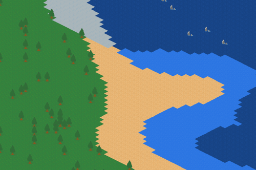

# isometric_terrain_simulator (WIP!)

This is my first attempt at simulating a basic isometric world.

## Controls

Arrow keys for panning
Z for zoom in
X for zoom out

## Method

The simulation currently involves two steps:

1. Sea level simulation: Using 2d perlin noise and a base distribution (currently radial), sea levels are simulated for the world. These values are then used to determine whether a tile should be water or land.
2. Temperature simulation: Using 2d perlin noise and distance from the equator, temperature levels are simulated for the world. These values are used to convert land/sand tiles to snow.

## TO DO

* Remove all hard coded values and parameterise everything.
* Introduce more base distributions for different land formations.

# Assets

Assets taken from https://www.kenney.nl/assets/nature-kit :-) 
